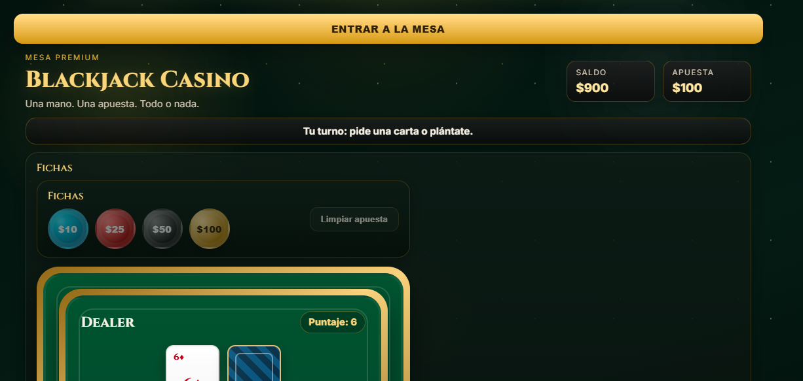

# Blackjack
Equipo 5 - TC1001S Herramientas computacionales: el arte de la programación

Partidas simples de blackjack con apuestas. Construido a base de HTML, CSS y JavaScript.

Para ejecutar el proyecto, únicamente se debe utilizar alguna herramienta que permita ejecutar en local.

Alternativamente, prueba la demo [aquí](https://mar-hz.github.io/Blackjack-ST/).

Se realiza una apuesta antes de cada partida, y se gana o pierde dinero dependiendo del resultado de la partida. En caso de quedarse sin dinero, se debe reiniciar la página para reestablecer el estado inicial del juego.